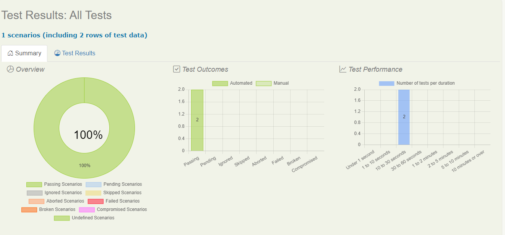

# serviceNSW

<!-- ABOUT THE PROJECT -->
## About The Project


</div>
Here is my project using Serenity Cucumber to Automate UI testing on service.nsw.gov.au. I also implement gherkin languange as main feature of this test. So it's quite easy to understand what to test and how the test work. 


### Built With

* [Java 1.8](https://www.oracle.com/java/technologies/downloads/)
* [Intellij IDEA]()
* [Maven]()


<!-- GETTING STARTED -->
## Getting Started

To get a local copy up and running follow these simple example steps.


### Installation

#### Method 1: Trough terminal (Maven Should be Installed)

Clone the repo
   ```sh
   git clone https://github.com/havidn/RestAssured-Weatherbit-Automation.git
   ```
Run Maven command
   ```sh
   mvn clean verify
   ```

<!-- USAGE EXAMPLES -->
## Usage

```sh
Feature: Search by keyword
  Scenario Outline: Search service center
    Given User already on home page
    And User search for "Apply for a number plate"
    When User click on Locate us button
    Then User redirect to "Find a Service NSW location" page
    And User enter suburb "<suburb>"
    Then Should show service centre name as "<Name>"
    Examples:
    |suburb|Name|
    |Sydney 2000|Marrickville Service Centre|
    |Sydney Domestic Airport 2020|Rockdale Service Centre|
```
  

<!-- CONTACT -->
## Contact
Havid Nursahgandi - [LinkedIn](https://www.linkedin.com/in/havid-nursahgandi/) - havidnursahgandi@gmail.com

